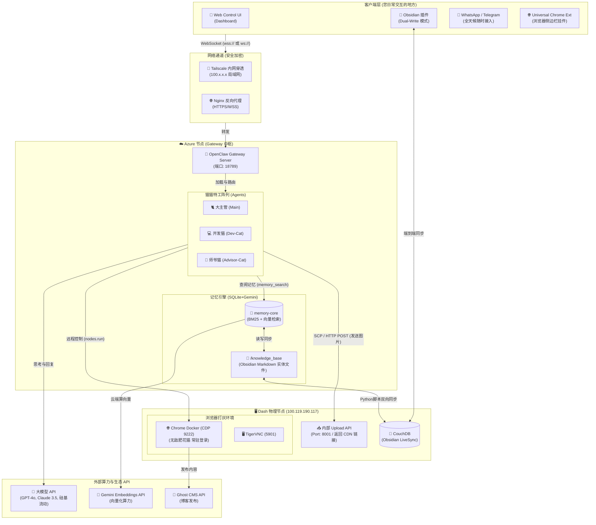

# OpenClaw 个人主权 AI 架构现状 (Current State)
*更新时间: 2026-03-09*

本图展示了主人当前正在运行的 OpenClaw 系统的真实拓扑结构，包括客户端如何通过安全通道（Tailscale / Cloudflare）与云端（Azure Gateway）连接，以及云端如何指挥不同环境下的无头浏览器节点。

```mermaid
graph TD
    %% 客户端层 (Client Layer)
    subgraph Clients["客户端层 (您日常交互的地方)"]
        WebChat["📱 Web Control UI<br>(Dashboard)"]
        Obsidian["📝 Obsidian 插件<br>(Dual-Write 模式)"]
        WhatsApp["💬 WhatsApp / Telegram<br>(全天候随时接入)"]
        ChromeExt["🌐 Universal Chrome Ext<br>(浏览器侧边栏挂件)"]
    end

    %% 网络隧道层 (Network Tunnel)
    subgraph Network["网络通道 (安全加密)"]
        Tailscale["🐉 Tailscale 内网穿透<br>(100.x.x.x 局域网)"]
        Nginx["🌐 Nginx 反向代理<br>(HTTPS/WSS)"]
    end

    %% 网关中枢层 (Gateway Layer)
    subgraph Cloud["☁️ Azure 节点 (Gateway 中枢)"]
        OpenClaw["🦞 OpenClaw Gateway Server<br>(端口: 18789)"]
        
        subgraph Memory["记忆引擎 (SQLite+Gemini)"]
            MemCore[("💾 memory-core<br>(BM25 + 向量检索)")]
            Markdown["📄 /knowledge_base<br>(Obsidian Markdown 实体文件)"]
        end
        
        subgraph Agents["猫猫特工阵列 (Agents)"]
            MainCat["🐈 大主管 (Main)"]
            DevCat["💻 开发猫 (Dev-Cat)"]
            AdvisorCat["🪭 师爷猫 (Advisor-Cat)"]
        end
    end

    %% 物理执行节点层 (Execution Node)
    subgraph DashNode["🖥️ Dash 物理节点 (100.119.190.117)"]
        UploadAPI["📥 内部 Upload API<br>(Port: 8001 / 返回 CDN 链接)"]
        CouchDB[("💽 CouchDB<br>(Obsidian LiveSync)")]
        
        subgraph BrowserEnv["浏览器打灰环境"]
            ChromeCDP["🌐 Chrome Docker (CDP 9222)<br>(无敌肥花猫 常驻登录)"]
            VNC["🖥️ TigerVNC (5901)"]
        end
    end

    %% 外部依赖层 (External APIs)
    subgraph External["外部算力与生态 API"]
        LLM["🧠 大模型 API<br>(GPT-4o, Claude 3.5, 硅基流动)"]
        Embed["🔢 Gemini Embeddings API<br>(向量化算力)"]
        Ghost["👻 Ghost CMS API<br>(博客发布)"]
    end

    %% 连线关系
    Clients --> |"WebSocket (wss:// 或 ws://)"| Network
    Network --> |"转发"| OpenClaw
    
    OpenClaw --> |"加载与路由"| Agents
    Agents --> |"查阅记忆 (memory_search)"| MemCore
    MemCore <--> |"读写同步"| Markdown
    MemCore --> |"云端算向量"| Embed
    Agents --> |"思考与回复"| LLM

    %% Dash 节点协作
    Agents --> |"SCP / HTTP POST (发送图片)"| UploadAPI
    Agents --> |"远程控制 (nodes.run)"| ChromeCDP
    ChromeCDP --> |"发布内容"| Ghost
    
    %% Obsidian 同步
    Obsidian <--> |"端到端同步"| CouchDB
    Markdown <--> |"Python脚本双向同步"| CouchDB
```
